# CampusCook - Workflow Diagrams

## 1. System Architecture

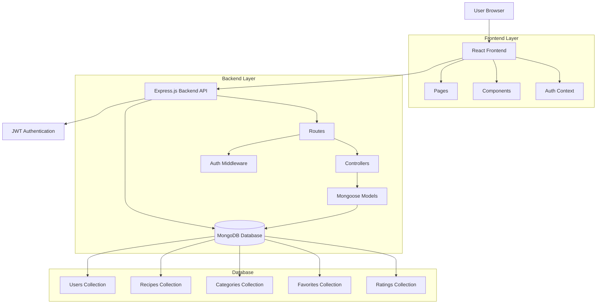

## 2. User Authentication Flow

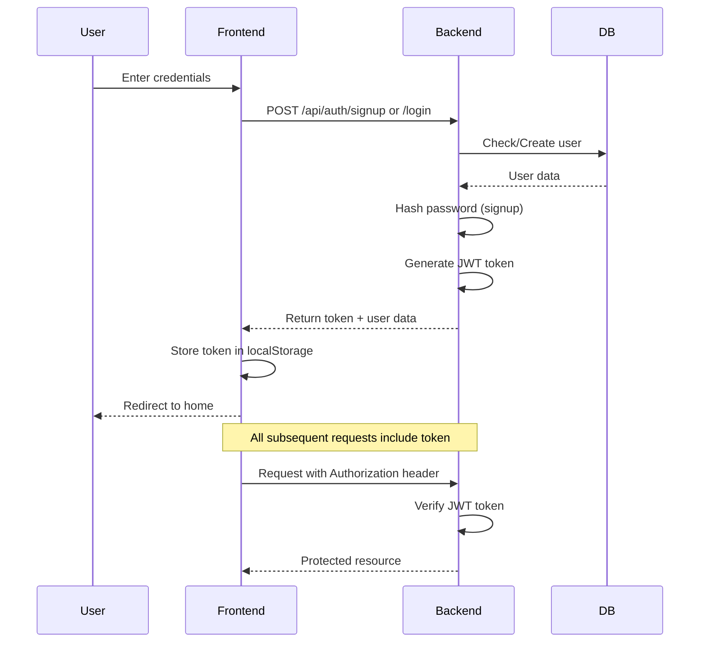

## 3. Recipe Creation Flow

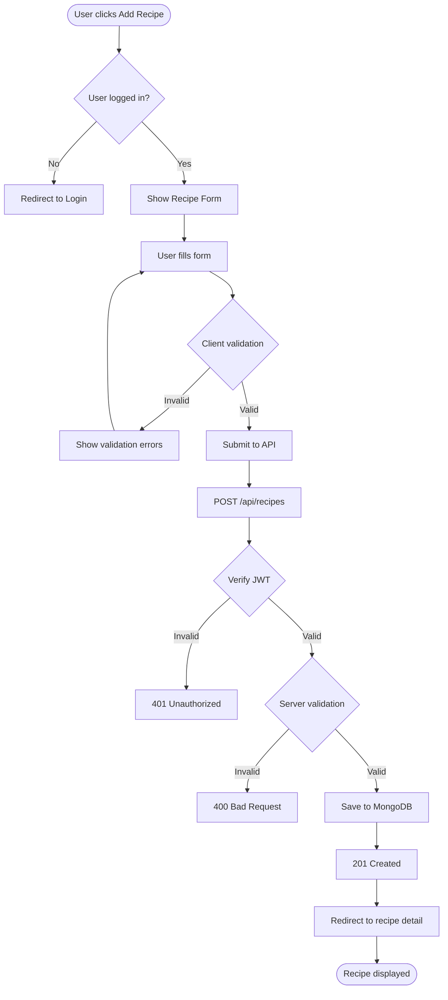

## 4. Recipe Search & Filter Flow

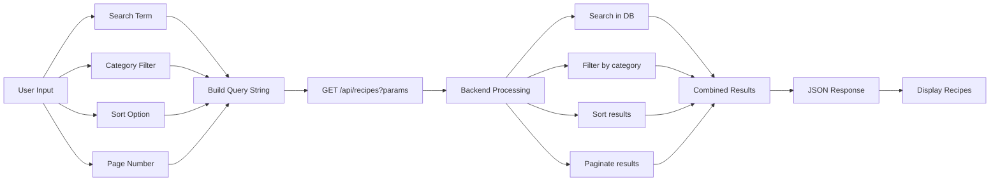

## 5. Recipe Rating Flow

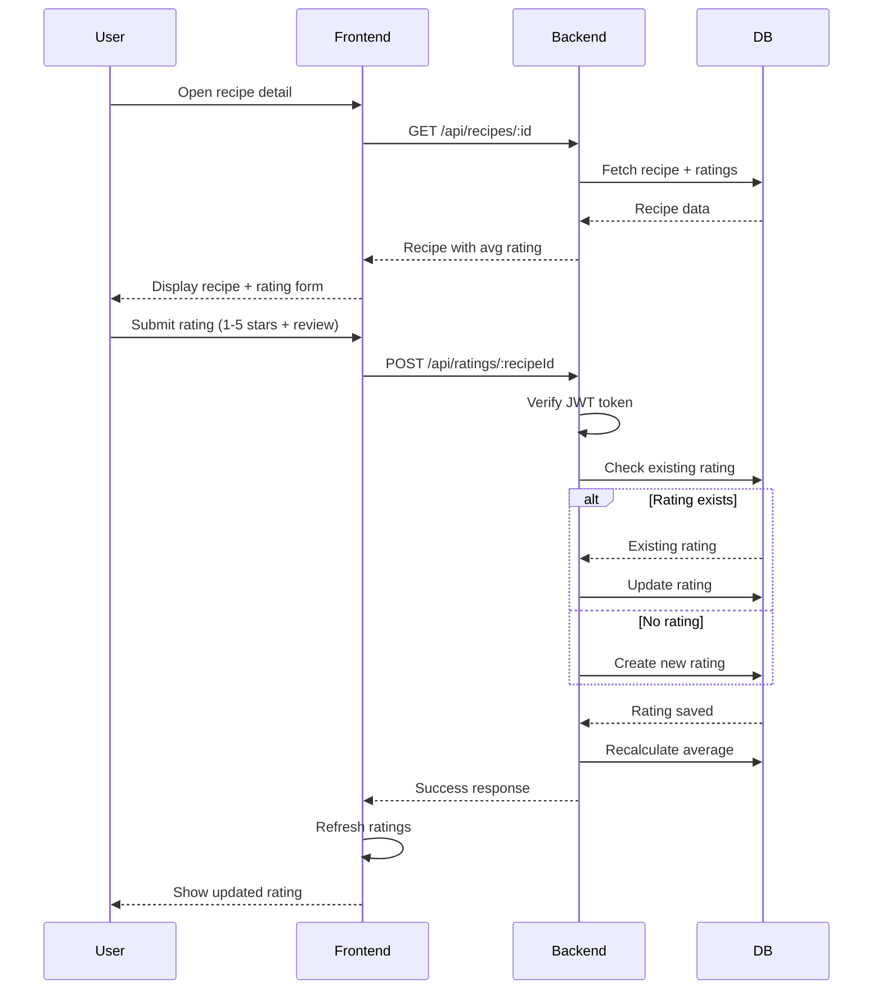

## 6. Favorites Management Flow

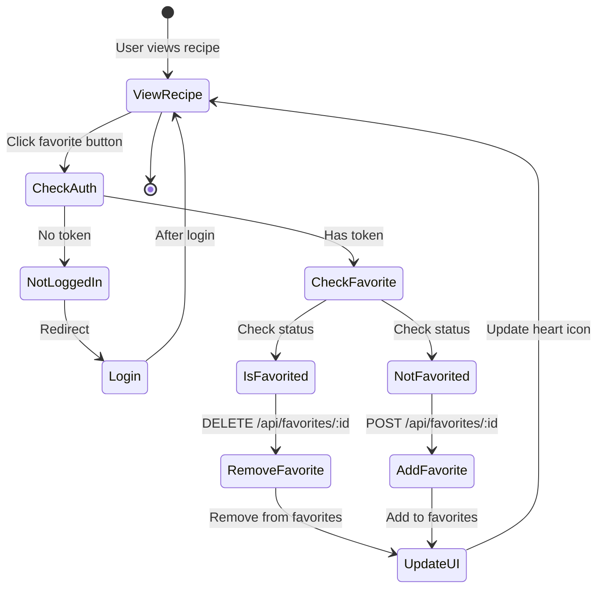

## 7. Admin Recipe Management Flow

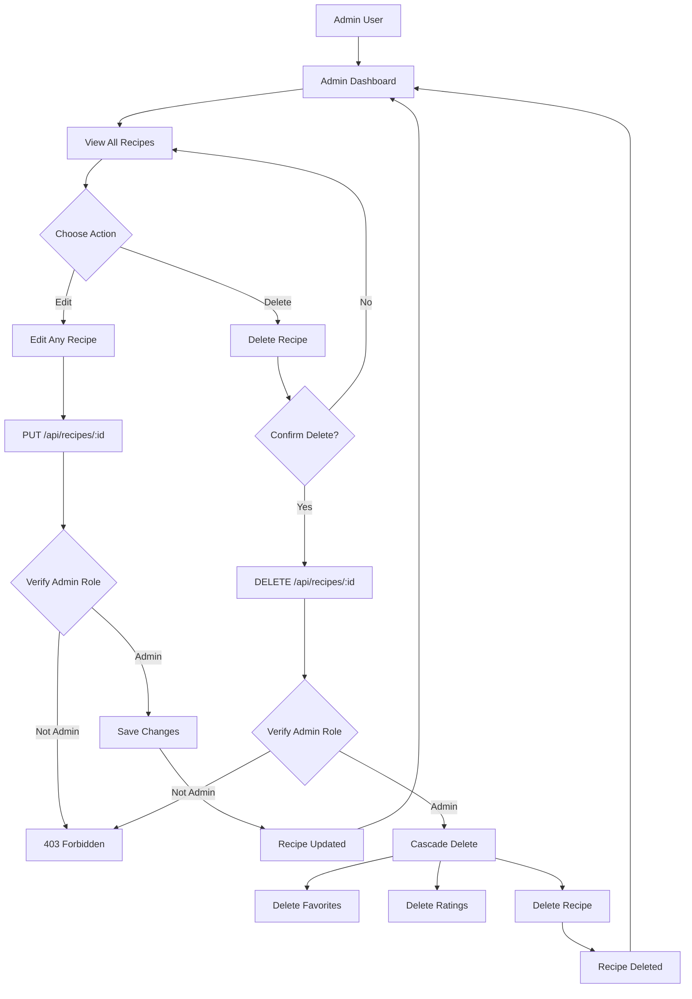

## 8. Complete User Journey

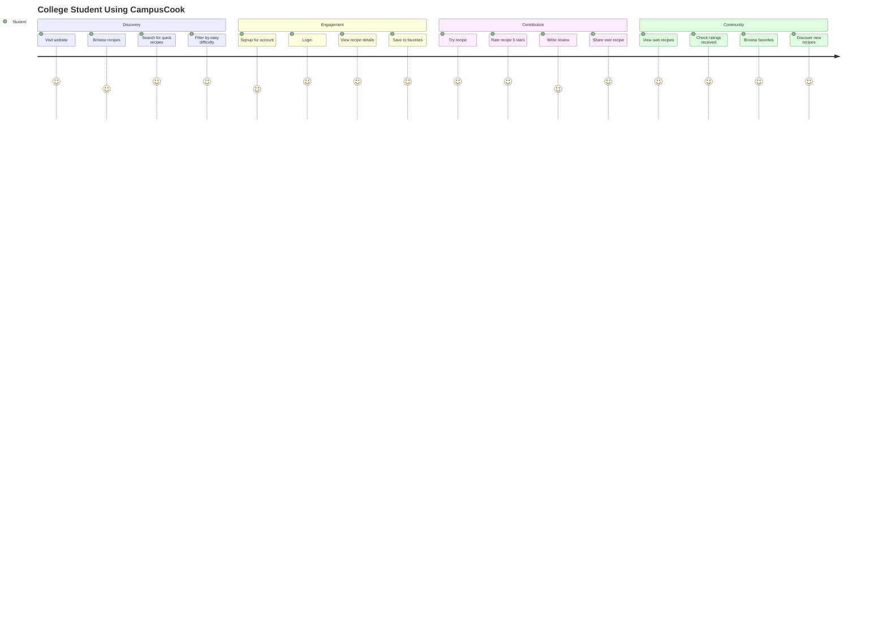

## 9. Data Flow Diagram

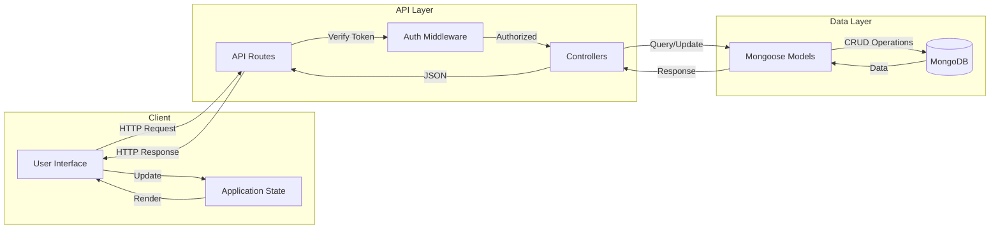

## 10. Recipe CRUD Operations

```mermaid
graph TD
    subgraph CREATE
        C1[User fills form] --> C2[POST /api/recipes]
        C2 --> C3[Validate data]
        C3 --> C4[Save to DB]
        C4 --> C5[Return recipe]
    end
    
    subgraph READ
        R1[Browse recipes] --> R2[GET /api/recipes]
        R2 --> R3[Query with filters]
        R3 --> R4[Return paginated list]
        
        R5[View details] --> R6[GET /api/recipes/:id]
        R6 --> R7[Fetch recipe + ratings]
        R7 --> R8[Return full details]
    end
    
    subgraph UPDATE
        U1[Edit recipe] --> U2[PUT /api/recipes/:id]
        U2 --> U3[Verify ownership]
        U3 --> U4[Update in DB]
        U4 --> U5[Return updated recipe]
    end
    
    subgraph DELETE
        D1[Delete recipe] --> D2[DELETE /api/recipes/:id]
        D2 --> D3[Verify admin role]
        D3 --> D4[Cascade delete]
        D4 --> D5[Remove from DB]
        D5 --> D6[Return success]
    end
```

## 11. Error Handling Flow

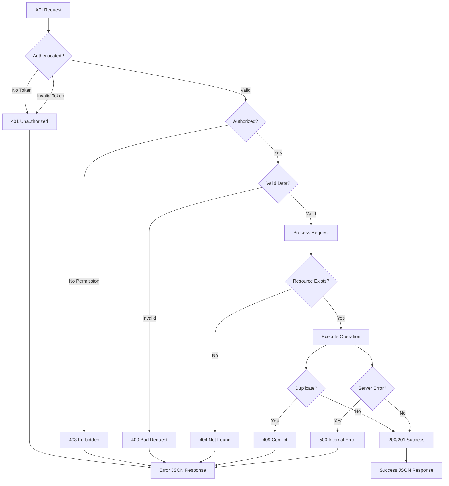

---

## Technology Stack Flow

```
┌─────────────────────────────────────────────────────────┐
│                     USER BROWSER                         │
│  ┌──────────────────────────────────────────────────┐  │
│  │           React Frontend (Port 3001)              │  │
│  │  • React Router  • Axios  • TailwindCSS          │  │
│  │  • Auth Context  • Components  • Pages           │  │
│  └──────────────────────────────────────────────────┘  │
└─────────────────────────────────────────────────────────┘
                          ↓ HTTP/HTTPS
┌─────────────────────────────────────────────────────────┐
│              Express.js Backend (Port 3000)              │
│  ┌──────────────────────────────────────────────────┐  │
│  │  Routes → Middleware → Controllers → Models      │  │
│  │  • JWT Auth  • bcrypt  • CORS  • Compression    │  │
│  └──────────────────────────────────────────────────┘  │
└─────────────────────────────────────────────────────────┘
                          ↓ MongoDB Protocol
┌─────────────────────────────────────────────────────────┐
│                  MongoDB Database                        │
│  ┌──────────────────────────────────────────────────┐  │
│  │  Collections: users, recipes, categories,        │  │
│  │              favorites, ratings                  │  │
│  │  • Mongoose ODM  • Indexes  • Validation        │  │
│  └──────────────────────────────────────────────────┘  │
└─────────────────────────────────────────────────────────┘
```

